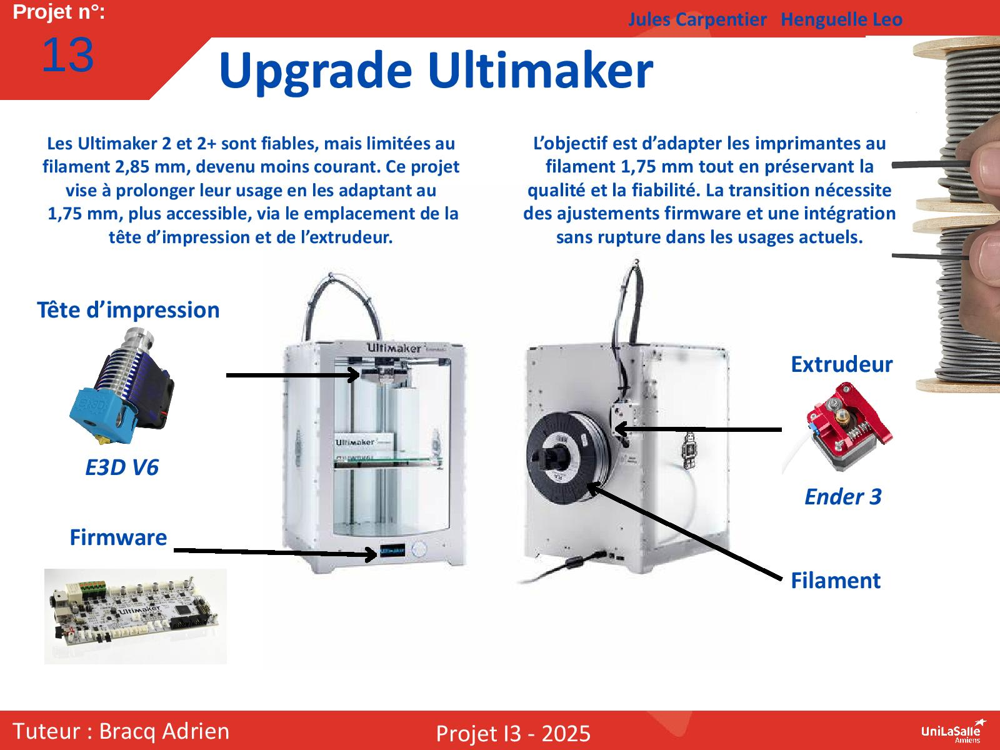

# Upgrade Ultimaker

Bienvenue dans la documentation du projet __"Upgrade Ultimaker 2/2+"__. Ce site a pour but de fournir toutes les informations nécessaires pour comprendre, utiliser et reproduire efficacement notre projet.

## À propos du Projet

Ce projet vise à moderniser les __Ultimaker 2 et 2+__ pour les adapter aux nouveaux standards d’impression 3D, en les rendant compatibles avec des bobines de 1,75 mm. L’objectif est d’installer une nouvelle tête d’impression et un nouvel extrudeur, puis d’intégrer ces imprimantes modifiées dans la ferme d’impression en validant la qualité des impressions obtenues.

## Poster

Ici vous publierez le poster de votre projet.

## Vidéo

ici vous publierez la vidéo de votre projet. 
- Moins de 1min30
- Présentation du projet 
- Des explication du fonctionnement du projet
- Des vues du projet / Prototype / Application etc... 
- Des plans du fonctionnement (même basique ou des éléments séparés)
- Une conclusion
- Si en stockage local : <50mo

## Démo vidéo
[🎥 Voir la vidéo](images/video.mp4)

---
